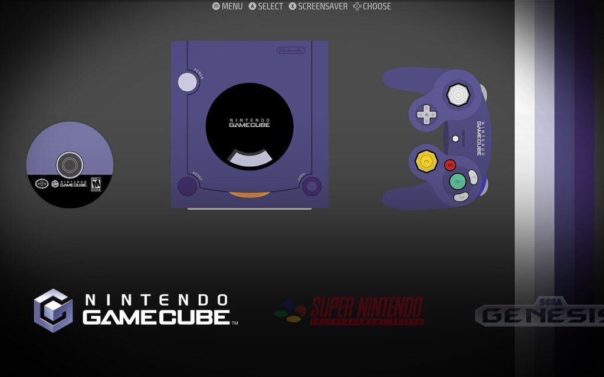
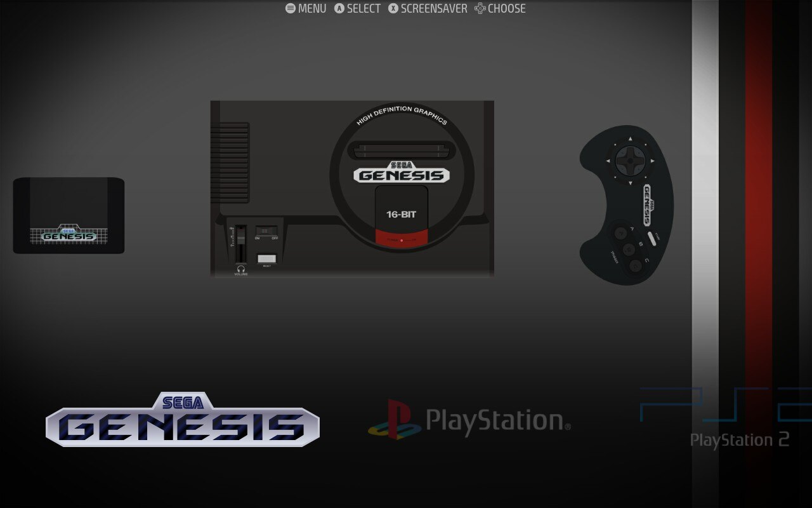
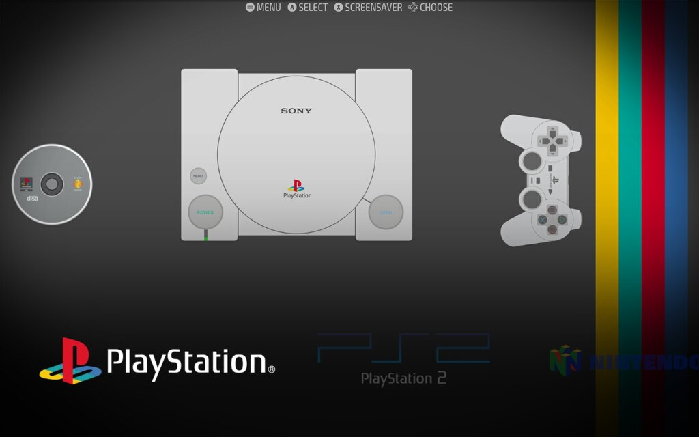
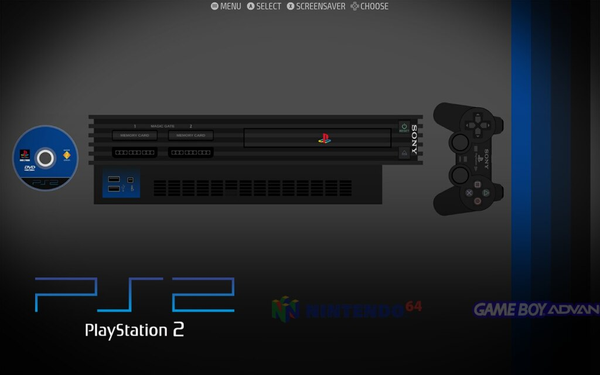
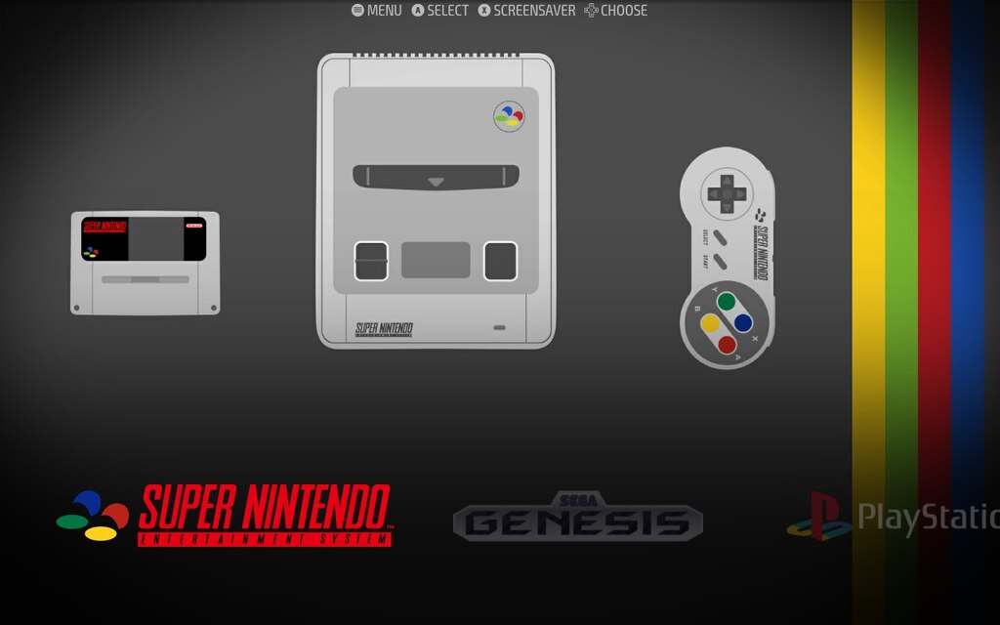
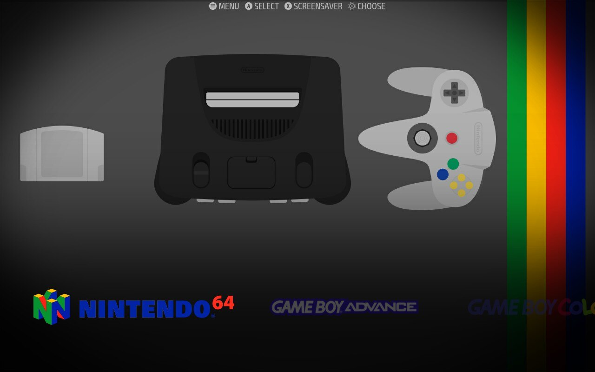
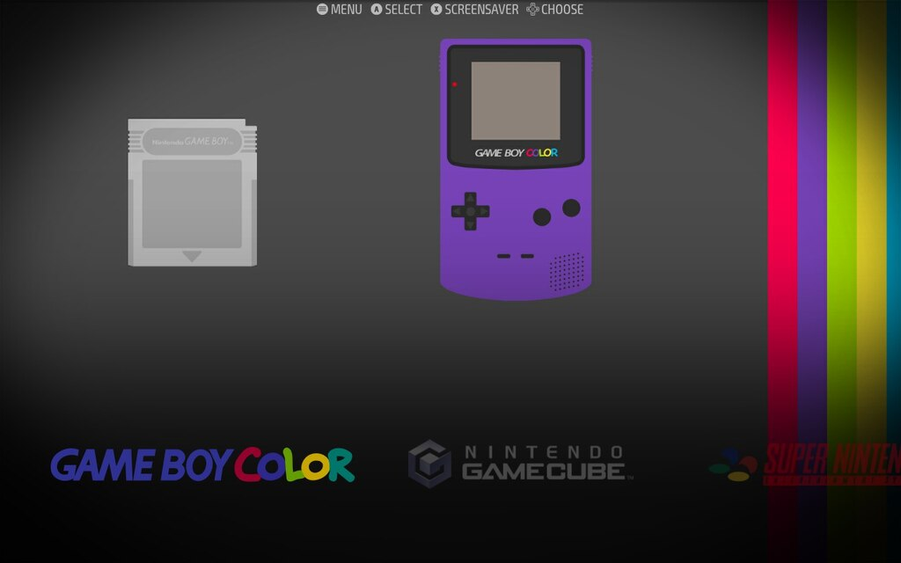

# CoinOPS x Slate System View Overhaul for EmulationStation Desktop Edition (ES-DE)

This customized theme **(built on Steam Deck)** is a fusion of the Slate CoinOPS theme by BritneysPAIRS (BP) and gjsmsmith, along with influences from [ARTFLIX](https://github.com/fagnerpc/Alekfull-ARTFLIX/) by [Alekfull](https://github.com/fagnerpc/) and [ARTFLIX-Colbalto](https://github.com/galisteogames/ARTFLIX-Cobalto/) by [Galisteo](https://github.com/galisteogames/).

## Compatibility
This theme is optimized for use with the Simple theme, ensuring that hardware elements do not overlap with the system name.

## Customization
To further edit and expand the theme:
- Refer to the ConsoleWallpapers.fig file in the _inc directory to add your own additional console wallpapers.
- Update your local device by adding new images to the following directories:
  - _inc/systems/images (only paneloverlay.png was changed)
  - _inc/systems/fanart
  - _inc/systems/logos

## Artwork Credits
All credit for the original artwork goes to the respective creators. This modification involves restructuring and recoloring to align with the desired aesthetic.

## Slate Theme Reference
Explore the original Slate artwork at [Slate Theme](https://gitlab.com/es-de/emulationstation-de/-/tree/stable-2.2/themes/slate-es-de).

Feel free to contribute and enhance this theme, and share your modifications with the community. Thank you for using the CoinOPS x Slate System View Overhaul for EmulationStation Desktop Edition (ES-DE)!

## **Key Changes**
- Removed Purple Hue on screen
- Used Slate images to create a set of wallpapers
- Changed Console logos on System view to white text where there is black (ex: Playstation 2 is now white text on System view)

## **Preview**

| New System Views                                  |
|---------------------------------------------------|
| GC            |
| Genesis  |
| PSX          |
| PS2          |
| SNES        |
| N64          |
| GBA          |
| GBC          |

| Old System View                                                                                                                                            | Gamelist View (UNCHANGED)                                                                                                                                  |
|------------------------------------------------------------------------------------------------------------------------------------------------------------|------------------------------------------------------------------------------------------------------------------------------------------------------------|
|  |  |

## **Configuration Options**

- The theme has a simple set of options that can be changed directly from the UI Settings menu of ES-DE 
- `Theme Variant` - sets the layout used for the sytem gamelist views.  There are 3 variants to choose from:
   - `Default` - Default view that displays system and gamelist metadata for each view
   - `No Hue` - The same as the Default view, but no blue/purple hue is applied to the system and fan art overlays
   - `Simple` - A minimalistic view with no metadata in the system or gamelist views
   - `Simple With Cover Art` - A minimalistic view with no metadata in the system or gamelist views (with cover art)
- `Theme Aspect Ratio` - sets the aspect ratio the theme will render at. If needed, this can be changed to match the aspect ratio of your screen (though it should happen automatically).
   - 16:9 and 16:10 are supported

### Preview of the Theme Variants (16:9)

| Theme Variant | System View | Gamelist View |
|----|----|----|
| Default |  |  |
| No Hue |  | 
| Simple |  |  
| Simple With Cover Art |  | 

## **Additional Notes**

### Scraping:

* This theme looks best when the following are set to be scraped under Scraper > Content Settings:
   * Game Names
   * Ratings
   * Other Metadata
   * Videos
   * Box Cover Images
   * Marquee (Wheel) Images
   * Fan Art Images
* Other media is optional and will be used in cases where one of the above is missing (for example Screenshot images will be used if Videos are missing)

### Per game cabinet art:
* This theme supports using a unique cabinet or TV images for each game
* I have made a set of these images available via a theme addon here: https://github.com/TheGrizzMD/coinops-es-de-addons

## **Acknowledgments**

- Cabinet Wheel theme from the CoinOPS project by BritneysPAIRS (BP).
- TV/Arcade Cabinet artwork by gjsmsmith.
- System Logos, and System images from [ARTFLIX](https://github.com/fagnerpc/Alekfull-ARTFLIX/) and [ARTFLIX-Colbalto](https://github.com/galisteogames/ARTFLIX-Cobalto/)
- If I overlooked any credits or acknowledgements, please let me know and I will add them.

## **License**

Creative Commons CC-BY-NC-SA - https://creativecommons.org/licenses/by-nc-sa/2.0/
You are free to share and adapt this theme as long as you provide attribution back as well share any updates you make under the same licence terms.
